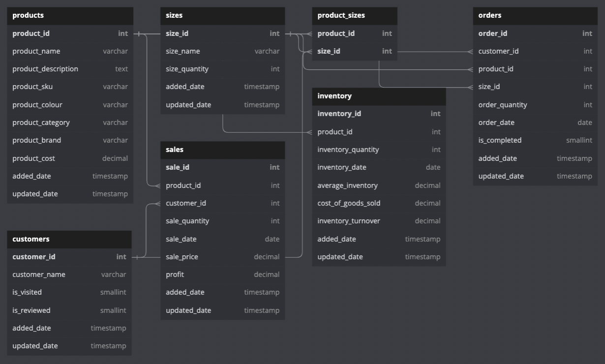

## Inventory Management System (IMS)

## Assumptions

## Key Features

- Pagination
- API Security (rate limiting, IP whitelisting)

## User Groups

## Entity Relationship Diagram

## Microservices Architecture

- gRPC for communication between microservices and MQ (Apache Kafka / RabbitMQ) for Pub-Sub messaging

|Service/Component|Description|
|---|---|
|NGINX Production Server|For Production Web Servers|
|API Gateway / Reverse Proxy|For handling incoming request for forwarding the requests to the respective microservice|
|Monitoring Service|Using WebSocket to keep track of the health of the microservices|
|Authentication Service|Using JWT Token to authenticate requests with PostgresSQL Database|
|Mail Service (2FA, Monitoring Reporting)|Using MailHog in development and using Kafka/RabbitMQ to subscribe to mail events|
|Logging Service|To store logs (Explore ELK Stack for this)|
|Inventory Service|To keep track of the count of inventory (Can explore Redis to store the product name, color or size names)|
|Order Service|To keep track of customer order or sales|
|Revenue Service|To keep track of the revenue generated from the sales of the inventory|

## DevOps

- Docker
  - Utilizing `docker-compose.yml` and `Dockerfile` to work with containers in development to ensure the application works similar to Production environment.
- Kubernetes
  - Utilizing Ingress Service, Deployment, and Pods k8s Objects with a declarative approach (using `.yml` configuration files) to setup the Kubernetes Cluster to enable scalability and availability.
- Gitlab CI/CD
  - Setup local Gitlab Runner to build, test and deploy the application to enable Continuous Integration and Continuous Deployment of the application to Production environment.

## Objectives

- Maintain quality control through accurate tracking of transactions involving consumer goods.
- Use sales data to constantly update and maintain precise inventory records.
- Avoid stock shortages by alerting the wholesaler when it is time to restock (through Email SMTP).
- Reduce errors in stock recording through automation.

## 3-Tier Architecture

|     Layer      |  Software  |
| :------------: | :--------: |
|    Database    | PostgreSQL |
|     Logic      |   Golang   |
| Presentational |  ReactJS   |

## User Group

|    User Group     |                                                    Description                                                     |
| :---------------: | :----------------------------------------------------------------------------------------------------------------: |
|       Admin       |         Managing user accounts and permissions. Implementing new features and improvements to the system.          |
|     IMS User      |              Can access all the functionalities of operations and financial analyst. (Self-Employed)               |
|    Operations     |  Use IMS to manage and track sales, customer details, inventory and place orders for the business. (Organisation)  |
| Financial Analyst | Use IMS to analyze financial data, such as profit margins, monthly profits, and inventory turnover. (Organisation) |

## User Stories

- As a user, I want to be able to login into my IMS account with a secure login method (2FA Authentication).
- As a non-user, I want to be able to sign up for a IMS account in the login page.
- As an admin, I want to able to create accounts for users and manage the permissions.
- As an admin, I want to able to view, edit and delete the accounts in the IMS.
- As a user, I want to be able to add a new product to the IMS.
- As a user, I want to be able to view, edit and delete the products in my IMS account.

## Entity-Relationship Diagram (ERD)

#### User Management ERD

#### Inventory Management ERD

## 2FA Authentication

- 2FA provides an additional layer of security as it mitigates the risks associated with weak or stolen passwords.
- By requiring the user to provide 2 different authentication factors, 2FA helps to protect against unauthorized access to an account or system.
- Cryptographically secure pseudorandom number generators (CSPRNG) were used to generate one-time passwords (OTPs) for two-factor authentication (2FA) over Psedorandom Number Generators (PRNG) due to the **increased security, enhanced randomness, and improved reliability**.
- In the **Generate2FA()** function, the OTP was generated in the format of 5 alphabets (lower and upper case) and 6 numbers separated by a hyphen "-" to provide a high level of randomness.

## Unit Testing - Test Driven Development (TDD)

- The main purpose of unit testing is to test the functionality of individual units of code to ensure that they are working as intended.
- Unit testing can also be used to establish a foundation for automated testing and continuous integration, which helps to maintain the quality and reliability of the software over time.
- The following steps were implemented in the process of TDD:
  1. Plan your test cases: Write down the different scenarios you want to test, and write down the expected input and output for each test case.
  2. Write the function: Write the function you want to test in code. At this point, the function should have any actual implementation. It should just have the correct function signature and return type.
  3. Write the unit test function: Write a unit test function that tests the function in step 2. The unit test function should take in the expected input and output for each test case, and use assertions to check that the function produces the correct output when given the expected input.
  4. Run the tests and refactor (if necessary).

---

- `coverage`
  - `alias coverage='go test -coverprofile=coverage.out && go tool cover -html=coverage.out'`
- Running ALL tests on /src directory
  - `go test -v ./...`
  - `go test ./...`
