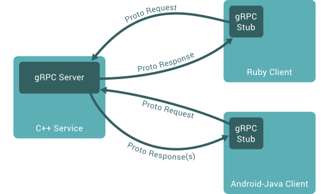

## gRPC (Google Remote Procedure Call)

### Commands

```
go install google.golang.org/protobuf/cmd/protoc-gen-go@v1.28
go install google.golang.org/grpc/cmd/protoc-gen-go-grpc@v1.2
export PATH="$PATH:$(go env GOPATH)/bin"
protoc --go_out=. --go-grpc_out=. proto/authentication.proto
protoc --go_out=. --go-grpc_out=. proto/users.proto
```

### Overview



- gRPC facilitates direct method calls from a client application to a server application on a different machine, streamlining the creation of distributed applications and services.
- It operates by defining a service that outlines remotely callable methods along with their parameters and return types, akin to many RPC systems.
- On the server side, the server implements this defined interface and operates a gRPC server to manage incoming client calls.
- The client side utilizes a stub (referred to as a client in some languages) that mirrors the server's methods, enabling remote method invocation.

### Protocol Buffers (protobuf)

- [Protocol Buffers](https://protobuf.dev/overview/)
- Data serialization mechanism by Google for structured data.
- Uses `.proto` files to define message structures.
- Messages consists of name-value pairs called fields.
- gRPC services are defined in `.proto` file, specifying RPC method parameters and return types as protocol buffer messages.

```proto
// example gRPC service definition in .proto file
service Greeter {
  rpc SayHello (HelloRequest) returns (HelloReply) {}
}

message HelloRequest {
  string name = 1;
}

message HelloReply {
  string message = 1;
}
```

### Compiler (protoc)

- Generates data access classes in desired languages from `.proto` files.
- Provides accessors for fields and methods for serialization / deserialization.
- For example, running protoc on a .proto file generates corresponding language-specific classes.
- These generated classes provides accessors for fields and methods to serialize / parse the entire structure to / from raw bytes.
- gRPC uses protoc with a specific gRPC plugin to generate client and server code from `.proto` files.
-

```
// Command ran in go to generate protoc file based on .proto (authentication.proto)
protoc --go_out=. --go-grpc_out=. proto/authentication.proto
```

### Service Definition

- Like many RPC systems, gRPC is based around the idea of defining a service, specifying the methods that can be called remotely with their parameters and return types.
- By default, gRPC uses **protocol buffers** as the Interface Definition Language (IDL) for describing both the service interface and the structure of the payload messages.

### 4 Kinds of Service Methods

[gRPC Core Concepts](https://grpc.io/docs/what-is-grpc/core-concepts/)

1. Unary RPC
   - The client sends a single request to the server and gets a single response back, just like a normal function call.
   ```proto
   rpc SayHello(HelloRequest) returns (HelloResponse);
   ```
2. Server Streaming RPC
   - The client sends a request to the server and gets a stream to read a sequence of messages back.
   - The client reads from the returned stream until there are no more messages.
   - gRPC guarantees **message ordering** within an individual RPC call.
   ```proto
   rpc LotsOfReplies(HelloRequest) returns (stream HelloResponse);
   ```
3. Client Streaming RPC
   - The client writes a sequence of messages and sends them to the server, again using a provided stream.
   - Once the client has finished writing the messages, it waits for the server to read them and return its response.
   - Again, gRPC guarantees **message ordering** within an individual RPC call.
   ```proto
   rpc LotsOfGreetings(stream HelloRequest) returns (HelloResponse);
   ```
4. Bidirectional Streaming RPC
   - Both client and server send a sequence of messages using a read-write stream.
   - The 2 streams operate independently, so clients and servers can read and write in whatever order they like.
     - For example, the server could wait to receive all the client messages before writing its responses, or it could alternately read a message then write a message, or some other combination of reads and writes.
   - The **order of messages in each stream is preserved**.
   ```proto
   rpc BidiHello(stream HelloRequest) returns (stream HelloResponse);
   ```

### Using the API

Starting from a service definition in a `.proto` file, gRPC provides protocol buffer compiler plugins that generate client- and server-side code. gRPC users typically call these APIs on the client side and implement the corresponding API on the server side.

- On the server side, the server implements the methods declared by the service and runs a gRPC server to handle client calls. The gRPC infrastructure decodes incoming requests, executes service methods, and encodes service responses.
- On the client side, the client has a local object known as a _stub_ (for some languages, the preferred term is client) that implements the same methods as the service. The client can then just call those methods on the local object, and the methods wrap the parameters for the call in the appropriate protocol buffer message type, sends the requests to the server, and return the server's protocol buffer responses.
