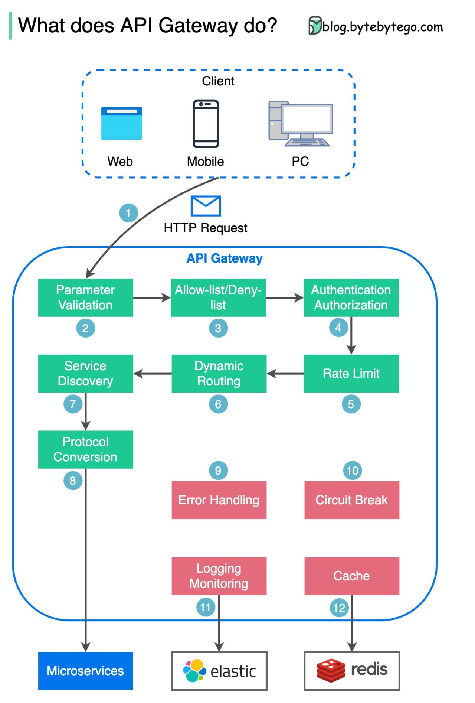

- [API Gateway](#api-gateway)
  - [Functions of the API Gateway](#functions-of-the-api-gateway)
- [Endpoints](#endpoints)
- [Hexagonal Architecture with Domain Driven Design](#hexagonal-architecture-with-domain-driven-design)
- [Gin Framework and API Gateway Resources](#gin-framework-and-api-gateway-resources)
- [API Gateway Diagram (ByteByteGo)](#api-gateway-diagram-bytebytego)

# API Gateway

The API Gateway in the inventory management system microservices architecture routes incoming client requests to the appropriate backend microservices.

## Functions of the API Gateway

|          Function of API Gateway          | Description                                                                                                      | Completed |
| :---------------------------------------: | ---------------------------------------------------------------------------------------------------------------- | :-------: |
|            Custom API Gateway             | A custom-built gateway that manages and routes traffic to various microservices                                  |    [x]    |
|              IP Whitelisting              | Using `gin-gonic`'s `c.ClientIP()` to retrieve and restrict access based on IP addresses                         |    [x]    |
|               Rate Limiter                | Using `golang.org/x/time/rate` which uses Token Bucket Algorithm, limiting requests based on client IP addresses |    [x]    |
|   gRPC Communication with Microservices   | For efficient, low-latency communication between services                                                        |    [x]    |
|            Logging (ELK Stack)            | To capture, store and visualize logs for better debugging and monitoring                                         |    [ ]    |
| Monitoring (Prometheus, Grafana, Datadog) | For tracking performance metrics, system health and alerts                                                       |    [ ]    |
|             Service Discovery             | Using `Hashicorp Consul` to dynamically route requests to available instances of microservices                   |    [ ]    |

# Endpoints

| Endpoint                 | Microservice           | Description                                             |
| ------------------------ | ---------------------- | ------------------------------------------------------- |
| `/`                      | API Gateway            | Health check endpoint to verify the gateway is running. |
| `/authenticate`          | Authentication Service | Endpoint to authenticate users (login).                 |
| `/signup`                | Authentication Service | Endpoint for user registration (signup).                |
| `/logout`                | Authentication Service | Endpoint to log out users.                              |
| `/users`                 | User Service           | Endpoint to retrieve all users.                         |
| `/user`                  | User Service           | Endpoint to update user information.                    |
| `/inventory/products`    | Inventory Service      | Endpoint to retrieve all products.                      |
| `/inventory/product/:id` | Inventory Service      | Endpoint to retrieve a product by ID.                   |
| `/inventory/product`     | Inventory Service      | Endpoint to create a new product.                       |
| `/inventory/product/:id` | Inventory Service      | Endpoint to update a product by ID.                     |
| `/inventory/product/:id` | Inventory Service      | Endpoint to delete a product by ID.                     |
| `/orders`                | Order Service          | Endpoint to retrieve all orders.                        |
| `/order/:id`             | Order Service          | Endpoint to retrieve an order by ID.                    |
| `/order`                 | Order Service          | Endpoint to create a new order.                         |

## Hexagonal Architecture with Domain Driven Design

Hexagonal architecture, also known as Ports and Adapters architecture, aims to decouple the core business logic from external systems and interfaces, ensuring that changes in these external components, such as databases or APIs, do not impact the core logic. This separation enhances testability by allowing the core logic to be tested in isolation using mock or stub implementations of external systems. It also improves flexibility and maintainability by enabling the easy adaptation or replacement of external components without affecting the core business logic. The architecture emphasizes the use of interfaces (ports) and their implementations (adapters), promoting the development and integration of new components or technologies without tightly coupling them to the core application.

- **Core (Domain Layer)**
  - This is where the core business logic resides. It contains the application's core rules and entities. The core layer is independent of external systems and focuses solely on the application's logic and behaviour.
  - **Entities** _(package domain)_: Represent the key objects or concepts of our application with their attributes.
  - **Use Cases** _(package auth/inventory/order/user)_: Define the application's specific operations and how the core entities interact. They orchestrate the core logic by coordinating various entities and applying business rules.
- **Ports**
  - Ports define the interfaces through which the core logic communicates with external system such as gRPC communication with microservices in API Gateway. They represent the application's entry points (input ports) and exit points (output ports).
  - **Inbound Ports**: These are interfaces that define how external systems can interact with the core logic. They expose the operations that the core logic offers to the outside world. For instance, in a web application, an inbound port might be an interface for creating or retrieving data.
  - **Outbound Ports**: These interfaces are used by the core logic to interact with external systems such as databases, messaging systems, or other microservices. They define how the core logic requests and receives information from external sources.
- **Adapters**
  - Adapters are responsible for converting data between the format used by the core logic and the format used by external systems. They implement the interfaces defined by the ports and handle the communication between the core logic and external systems.
  - **Inbound**: These adapters handle requests coming from external systems and translate them into a format that the core logic can understand. For instance, the `CreateProduct` endpoint receives HTTP requests and maps the DTO `CreateProductRequest` to `domain.Product` which is used in the core layer.
  - **Outbound**: These adapters implement the outbound ports and manage communication with external systems. For instance, a repository class (gRPC) that interacts with another microservice to retrieve data is an outbound adapter.

## Gin Framework and API Gateway Resources

- `gin` golang framework
- `go get -u github.com/go-chi/chi/v5`
- [Write your own API Gateway](https://itnext.io/why-should-you-write-your-own-api-gateway-from-scratch-378074bfc49e)
- [Gin Framework](https://github.com/gin-gonic/gin)

## API Gateway Diagram (ByteByteGo)

  

