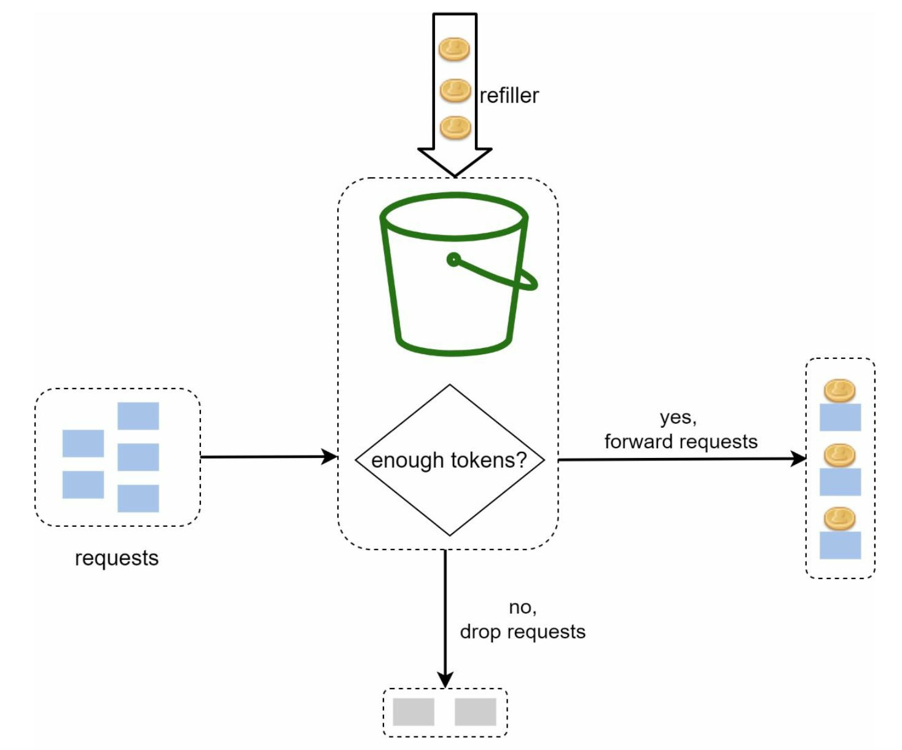
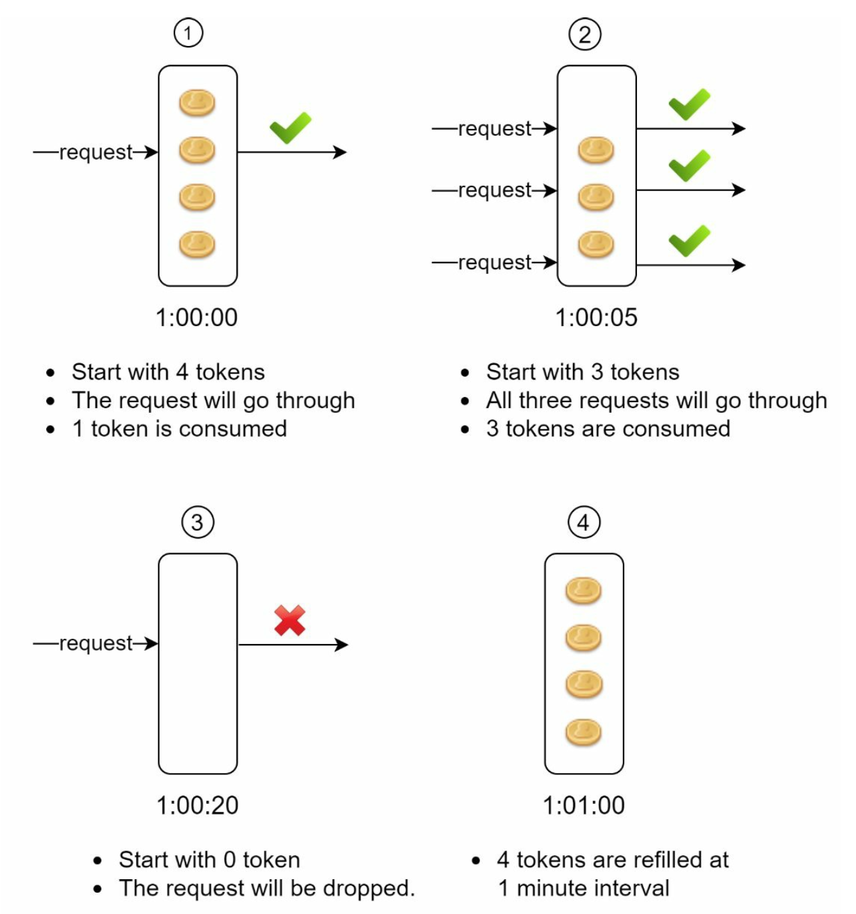

# What is a Rate Limiter?

- In a network system, a rate limiter is used to control the rate of traffic sent by a client or a service.
- In the HTTP world, a rate limiter limits the number of client requests allowed to be sent over a specified period.
- If the API request count exceeds the threshold defined by the rate limiter, all the excess calls are blocked.
  - Examples:
    - A user can write no more than 2 posts per second.
    - You can create a maximum of 10 accounts per day from the same IP address.
    - You can claim rewards no more than 5 times per week from the same device.
- Benefits of an API rate limiter:
  - Prevent resource starvation caused by Denial of Service (DoS) attacks.
    - Almost all APIs published by large tech companies enforce some form of rate limiting. A rate limiter prevents DoS attacks, either intentional or unintentional, by blocking the excess calls.
    - Examples:
      - Twitter limits the number of tweets to 300 per 3 hours.
      - Google docs APIs have the following default limit of 300 per user per minute for read requests.
  - Reduce cost.
    - Limiting excess requests means fewer servers and allocating more resources to high priority APIs.
    - Rate limiting is extremely important for companies that use paid third party APIs.
      - For example, you are charged on a per-call basis for the following external APIs - check credit, make a payment, retrieve health records. Limiting the number of calls is essential to reduce costs.
  - Prevent servers from being overloaded.
    - To reduce server load, a rate limiter is used to filter out excess request caused by bots or users' misbehavior.

# Design a Rate Limiter in IMS

## 1. Understand the Problem and Establish the Design Scope

Rate limiting can be implemented using different algorithms, each with its pros and cons. There are some questions to ask ourselves before building a rate limiter.

|Question|Answer|
|:-:|--|
|What kind of rate limiter are we going to design? Client-Side or Server-Side rate limiter?|Server-Side API rate limiter.|
|Does the rate limiter throttle API requests based on IP, the user ID or other properties?|The rate limiter will throttle requests based on user ID because IMS has multiple individual consumers who don’t belong to an organization. Throttling by IP is unsuitable since multiple users on the same public network (e.g., Starbucks Wi-Fi) could be blocked unnecessarily.|
|What is the scale of the system? Is it built for a startup or a big company with a large user base?|The system must handle a large number of requests, ensuring scalability.|
|Will the system work in a distributed environment?|Yes, the rate limiter will be designed to work in a distributed setup.|
|Do we need to inform users who are throttled?|Yes, users will receive an HTTP 429 (Too Many Requests) response when throttled.|

## 2. High-Level Design

- Rate Limiter will be placed on the **server-side** and the API Gateway will enforce rate limits before forwarding requests to microservices.

## 3. Selecting Algorithm for Rate Limiting

- For IMS, we will be using the **Token Bucket** algorithm for rate limiting for simplicity and ease of understanding. Both Amazon and Stripe also use this algorithm to throttle their API Requests.

- A token bucket is a container that has pre-defined capacity. Tokens are put in the bucket at preset rate periodically. 
- Once the bucket is full, no more tokens are added. As shown in the diagram above, the token bucket capacity is 4.
- The refiller puts 2 tokens into the bucket every second. Once the bucket is full, extra tokens will overflow.
- Each incoming client request consumes one token. When a request arrives, we check if there are enough tokens in the bucket.
    - If there are enough tokens, we take one token out for each request, and the request goes through.
    - If there are not enough tokens, the requests is dropped.

- In IMS, the token bucket size is 4 and the refill rate is 4 per minute. *Note: These settings can be found in configuration (YAML) files for ease of changing the limits.*

- The token bucket algorithm takes 2 parameters:
    - **Bucket Size**: maximum number of tokens allowed in the bucket.
    - **Refill Rate**: number of tokens put into the bucket every second.
- How many buckets do we need for IMS? Let's think about this.
    - A typical user to IMS could perform the following actions: login (user microservice) once per second, view available inventory (inventory microservice) per second, add customer orders (order microservice) per second. The API Gateway will also be hit as well with a client request. Thus, 4 buckets are required for each user.
