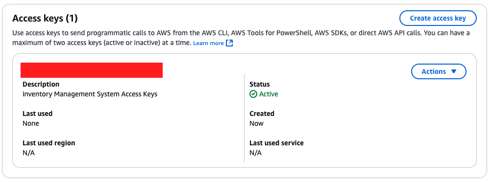

# Setting up IAM User

- Login to AWS as root user and created an AWS User for IMS.
- Assigned `admin` policy to the created IAM User
- Login to AWS as IAM User for IMS

# Creating Access Key and Secret on AWS Management Console



- After logging in as IAM User, navigate to IAM page and "Create access key"
- Save Access Key and Secret to be configured in AWS CLI later.

# Setting up AWS CLI

## Step 1: Install AWS CLI

- On MacOS, run `brew install awscli` after you have installed Homebrew.
- If you have already installed `awscli` in the past, run `brew reinstall awscli` to update to the latest version, this step is not really needed but it's a good practice.
- Verify the installation with `aws --version`

```sh
(base) ➜  ~ aws --version
aws-cli/2.13.21 Python/3.11.5 Darwin/21.6.0 exe/x86_64 prompt/off
```

## Step 2: Configure AWS CLI with Access Key and Secret Key

- Run `aws configure`.
- For AWS Region, I have selected `ap-southeast-1` because I am from Singapore 😊🇸🇬!

```sh
(base) ➜  ~ aws configure
AWS Access Key ID [None]: <ACCESS_KEY>
AWS Secret Access Key [None]: <SECRET_KEY>
Default region name [None]: ap-southeast-1
Default output format [None]: json
```

## Step 3: Install EB CLI

- On MacOS, run `brew install awsebcli` to deploy IMS application on Elastic Beanstalk
- To verify the installation, run `eb --version`

## Optional: View AWS Credentials File

- AWS CLI credentials (Access Key and Secret Key) are saved in a file called `credentials` in the following directory `~/.aws/credentials`
- To view the credentials, run `cat ~/.aws/credentials`
- To remove the credentials, run `rm ~/.aws/credentials` and verify with `ls ~/.aws`

## Areas of Improvement

- **Least Privilege Principle**: Instead of assigning the `admin` role to the IAM User, we should assign only the permissions this user needs to run the IMS Application. Since we are planning to deploy to AWS Elastic Beanstalk, AWS EC2, AWS EKS, we could use the AWS Managed Policies - `AWSElasticBeanstalkFullAccess`, `AmazonEC2FullAccess` and `AmazonEKSFullAccess`.
