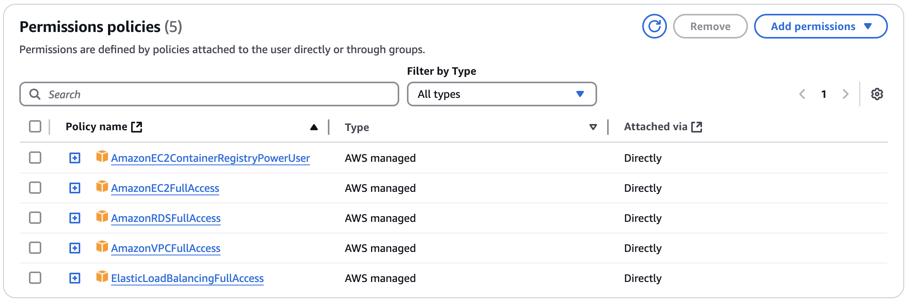
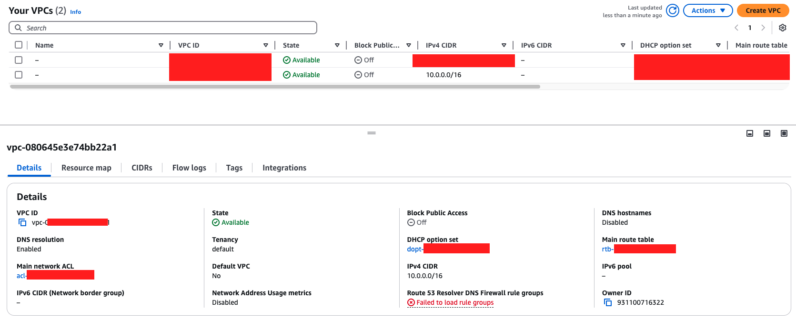

# IMS Deployment to AWS EC2 (Elastic Compute Cloud)

## Prerequisites

Before deploying IMS to AWS EC2, ensure you have the following:

- An AWS Account
- **AWS CLI** installed and configured (`aws configure`)
- **Docker** installed
- **Elastic Beanstalk CLI (EB CLI)** installed (`pip install awsebcli`)
- A **PostgreSQL Database** (Use AWS RDS or deploy inside Elastic Beanstalk)

# IAM Permissions (Least Privilege Principle)



|              EC2 Policy               |                                                           Purpose                                                            |
| :-----------------------------------: | :--------------------------------------------------------------------------------------------------------------------------: |
| `AmazonEC2ContainerRegistryPowerUser` |                              Allows access to Amazon ECR for pushing and pulling Docker images.                              |
|         `AmazonEC2FullAccess`         | Allows full access to EC2 instances for creating, describing, and managing EC2 instances, security groups, VPCs and subnets. |
|         `AmazonRDSFullAccess`         |                     Allows full access to RDS for managing and interacting with the PostgreSQL database.                     |
|         `AmazonVPCFullAccess`         |                             Allows management of VPC, subnets, and other networking components.                              |
|   `ElasticLoadBalancingFullAccess`    |            Allows full access to ALB/ELB for creating and managing load balancers, listeners, and target groups.             |

# 1. Plan the Architecture

- **ECS Instances** for API Gateway and Authentication Microservice.
- **Amazon RDS (PostgreSQL)** for database storage.
- **Application Load Balancer (ALB)** to handle traffic distribution to API Gateway.
- **VPC (Virtual Private Cloud)** for network isolation and security.
- **Security Groups** to define access rules.
- **IAM Roles & Policies** to control access to AWS services.

# 2. Create a VPC, Subnets and Security Groups

## 2.1 Create a VPC



- Since using a public IP for EC2 is not recommended in production (security risk), we will place the backend in a **private subnet** and use an **ALB in a public subnet** to expose the API Gateway.
- `10.0.0.0/16` falls within the private IP address ranges for use within private networks

```bash
aws ec2 create-vpc --cidr-block 10.0.0.0/16 --region ap-southeast-1
# Outputs: <VpcId>
```

## 2.2 Create Subnets

- Public Subnet (for ALB) to **communicate directly with the internet**.

```bash
aws ec2 create-subnet --vpc-id <VpcId> --cidr-block 10.0.1.0/24 --availability-zone ap-southeast-1a
```

- Private Subnet (for EC2 instances) where resources are **not directly accessible from the internet**.

```bash
aws ec2 create-subnet --vpc-id <VpcId> --cidr-block 10.0.2.0/24 --availability-zone ap-southeast-1a
```

## 2.3 Create an Internet Gateway & Attach it

- Internet Gateway (IGW) in an AWS VPC serves as the connection point between VPC and the public internet.
- It is required for public subnets to allow outbound and inbound internet access.
- It is needed to make Application Load Balancer (ALB) to be publicly accessible.

```bash
aws ec2 create-internet-gateway --region ap-southeast-1
aws ec2 attach-internet-gateway --internet-gateway-id <IGW_ID> --vpc-id <VpcId>
```

## 2.4 Create Route Table & Associate with Public Subnet

- Create a Route Table in VPC and associate it with a public subnet, and route traffic from that subnet to the Internet Gateway (IGW).
- Add a route to the Internet Gateway (IGW), configure it to send all internet-bound traffic to the Internet Gateway.
- Associate the Route Table with a Public Subnet, allowing instances in that subnet to use it for internet access.

```bash
# Creates a new route table within VPC to define how traffic should be routed
aws ec2 create-route-table --vpc-id <VpcId> --region ap-southeast-1

# Adds a route in the route table that sends all traffic destined for the internet (0.0.0.0/0) to the Internet Gateway (IGW)
aws ec2 create-route --route-table-id <RTB_ID> --destination-cidr-block 0.0.0.0/0 --gateway-id <IGW_ID> --region ap-southeast-1

# Associates the route table with a public subnet, enabling instances in that subnet to route internet-bound traffic to the IGW
aws ec2 associate-route-table --route-table-id <RTB_ID> --subnet-id <PUBLIC_SUBNET_ID> --region ap-southeast-1
```

## 2.5 Create Security Groups

- ALB Security Group (allow HTTP/HTTPS)

```bash
# Create a new security group in the specified VPC
aws ec2 create-security-group --group-name ALB-SG --description "Security group for ALB" --vpc-id <VpcId>

# Modifies the security group to allow inbound traffic over HTTP (port 80) and HTTPS (port 443) from anywhere 0.0.0.0/0
aws ec2 authorize-security-group-ingress --group-id <ALB_SG_ID> --protocol tcp --port 80 --cidr 0.0.0.0/0
aws ec2 authorize-security-group-ingress --group-id <ALB_SG_ID> --protocol tcp --port 443 --cidr 0.0.0.0/0
```

- Backend Security Group (allow internal traffic)

```bash
# Create a new security group in the specified VPC
aws ec2 create-security-group --group-name Backend-SG --description "Security group for backend services" --vpc-id <VpcId>

# Allows inbound TCP traffic on port 50051 (typically used for gRPC services) from the ALB Security Group <ALB_SG_ID>
# This rule enabled your backend services to accept traffic from the gRPC API Gateway (associated with ALB in public subnet)
aws ec2 authorize-security-group-ingress --group-id <BACKEND_SG_ID> --protocol tcp --port 50051 --source-group <ALB_SG_ID>

# Allows internal communication between instances that are associated with the same backend security group <BACKEND_SG_ID> on port 5432 (PostgreSQL)
aws ec2 authorize-security-group-ingress --group-id <BACKEND_SG_ID> --protocol tcp --port 5432 --source-group <BACKEND_SG_ID>
```

# 3. Set up RDS PostgreSQL

# 4. Launch EC2 Instances for API Gateway and Authentication Microservice

## 4.1 Create an EC2 Key Pair

```bash
aws ec2 create-key-pair --key-name $EC2_API_GATEWAY_KEY_NAME --query 'KeyMaterial' --output text > $EC2_API_GATEWAY_KEY_NAME.pem
chmod 400 $EC2_API_GATEWAY_KEY_NAME.pem

aws ec2 create-key-pair --key-name $EC2_AUTH_MICROSERVICE_KEY_NAME --query 'KeyMaterial' --output text > $EC2_AUTH_MICROSERVICE_KEY_NAME.pem
chmod 400 $EC2_AUTH_MICROSERVICE_KEY_NAME.pem
```

## 4.2 Launch EC2 Instances

```bash
# Only creates 1 EC2 instance for API Gateway because of --count 1
API_GATEWAY_INSTANCE_ID=$(aws ec2 run-instances \
  --image-id ami-06661384e66f2da0e \
  --count 1 \
  --instance-type t3.micro \
  --key-name $EC2_API_GATEWAY_KEY_NAME \
  --security-group-ids $API_GATEWAY_SG_ID \
  --subnet-id $PrivateSubnetId \
  --query 'Instances[0].InstanceId' \
  --output text)

# Only creates 1 EC2 instance for Authentication Microservice because of --count 1
AUTH_SERVICE_INSTANCE_ID=$(aws ec2 run-instances \
  --image-id ami-06661384e66f2da0e \
  --count 1 \
  --instance-type t3.micro \
  --key-name $EC2_AUTH_MICROSERVICE_KEY_NAME \
  --security-group-ids $AUTH_SG_ID \
  --subnet-id $PrivateSubnetId \
  --query 'Instances[0].InstanceId' \
  --output text)
```

## 4.3 Define user-data script

- Need user-data script for api gateway and authentication microservice

```bash
#!/bin/bash
set -e  # Exit if any command fails

# Update system and install Docker
yum update -y
yum install -y docker
systemctl start docker
systemctl enable docker

# Add EC2 user to Docker group (avoids permission issues)
usermod -aG docker ec2-user

# Authenticate to Amazon ECR (Uses IAM role attached to EC2)
aws ecr get-login-password --region ap-southeast-1 | docker login --username AWS --password-stdin <AWS_ACCOUNT_ID>.dkr.ecr.ap-southeast-1.amazonaws.com

# Pull the latest images from ECR
docker pull <AWS_ACCOUNT_ID>.dkr.ecr.ap-southeast-1.amazonaws.com/api-gateway:latest
docker pull <AWS_ACCOUNT_ID>.dkr.ecr.ap-southeast-1.amazonaws.com/authentication-service:latest

# Run the API Gateway container on port 80
docker run -d --name api-gateway -p 80:8080 <AWS_ACCOUNT_ID>.dkr.ecr.ap-southeast-1.amazonaws.com/api-gateway:latest

# Run the Authentication Service container on gRPC port 50051
docker run -d --name authentication-service -p 50051:50051 <AWS_ACCOUNT_ID>.dkr.ecr.ap-southeast-1.amazonaws.com/authentication-service:latest
```

# 5. SSH into EC2 & Deploy Microservices

- Once the EC2 instances are running, SSH into them and deploy the services.

```bash
ssh -i IMSKeyPair.pem ec2-user@<PRIVATE_IP>
```

## 5.1 Install Docker & Start Services

On each instance:

```bash
sudo yum update -y
sudo amazon-linux-extras enable docker
sudo yum install -y docker
sudo service docker start
sudo usermod -aG docker ec2-user
```

## 5.2 Deploy Containers

- On API Gateway EC2

```bash
docker run -d --name api-gateway -p 8080:8080 my-api-gateway-image
```

- On Authentication Microservice EC2

```bash
docker run -d --name auth-service -p 50051:50051 my-auth-service-image
```

# 6. Set Up ALB to Route Traffic

- These commands set up an ALB (Application Load Balancer) to route traffic to your API Gateway EC2 instance.

```bash
# Create ALB --> Sets up a public Application Load Balancer in a specified subnet
aws elbv2 create-load-balancer --name my-alb --subnets <PUBLIC_SUBNET_ID> --security-groups <ALB_SG_ID>

# Create Target Group --> Defines where ALB should forward traffic (API Gateway on port 8080)
aws elbv2 create-target-group --name api-gateway-tg --protocol HTTP --port 8080 --vpc-id <VpcId>

# Register Target --> Links the API Gateway EC2 instance to the Target Group
aws elbv2 register-targets --target-group-arn <TARGET_GROUP_ARN> --targets Id=<API_GATEWAY_EC2_ID>

# Create Listener --> Configures ALB to listen on port 80 and forward requests to the Target Group
aws elbv2 create-listener --load-balancer-arn <ALB_ARN> --protocol HTTP --port 80 --default-actions Type=forward,TargetGroupArn=<TARGET_GROUP_ARN>
```

# 7. Test the Deployment

- Get ALB DNS Name

```bash
aws elbv2 describe-load-balancers --query 'LoadBalancers[*].DNSName'
```

- Test API Gateway

```bash
curl http://<ALB_DNS_NAME>/health
```

# 8. Clean Up

- To delete everything:

```bash
aws ec2 terminate-instances --instance-ids <INSTANCE_ID>
aws elbv2 delete-load-balancer --load-balancer-arn <ALB_ARN>
aws rds delete-db-instance --db-instance-identifier my-postgres-db --skip-final-snapshot
aws ec2 delete-vpc --vpc-id <VpcId>
```

# Other commands

```bash
# Check currently logged in AWS CLI user
aws sts get-caller-identity

# Configure new user on AWS CLI
aws configure --profile <username>
export AWS_PROFILE=<username>
```

# 502 Bad Gateway Errors in ALB

```
1️⃣ ALB Target Group has unhealthy targets (API Gateway isn’t responding correctly).
# To check if API Gateway instance is healthy
aws elbv2 describe-target-health --target-group-arn $API_GATEWAY_TG_ARN

2️⃣ Security group rules are incorrect (ALB can’t reach API Gateway).
# To check ALB SG rules
aws ec2 describe-security-groups --group-ids $ALB_SG_ID

3️⃣ API Gateway isn’t running or is listening on the wrong port.
# Check API Gateway SG rules
aws ec2 describe-security-groups --group-ids $API_GATEWAY_SG_ID

4️⃣ Your ALB health check is failing (wrong path or port).
# Check ALB health check settings
aws elbv2 describe-target-groups --target-group-arns $API_GATEWAY_TG_ARN

# If the health check path is wrong (/health or /healthcheck), fix it:
aws elbv2 modify-target-group --target-group-arn $API_GATEWAY_TG_ARN --health-check-path /health
```

# Notes

- Created IAM role with AmazonEC2ContainerRegistryReadOnly (to pull image and authenticate with ECR in ec2 instance) and AmazonEC2FullAccess (to release elastic IP of NAT Gateway when cleaning up)
- Logs in EC2
  - https://stackoverflow.com/questions/15904095/how-to-check-whether-my-user-data-passing-to-ec2-instance-is-working
  - /var/log/cloud-init.log
  - /var/log/cloud-init-output.log
