# IMS Deployment to AWS Elastic Beanstalk (EBS)

<p align="center">
  
</p>

## Step 1: Prerequisites

Before deploying IMS to AWS EBS, ensure you have the following:

- An AWS Account
- **AWS CLI** installed and configured (`aws configure`)
- **Docker** installed
- **Elastic Beanstalk CLI (EB CLI)** installed (`pip install awsebcli`)
- A **PostgreSQL Database** (Use AWS RDS or deploy inside Elastic Beanstalk)

## Step 1: Setup AWS RDS (PostgreSQL)

Authentication Microservice requires a PostgreSQL database, so we need an **RDS Instance** on AWS.

### 1.1 Create an RDS PostgreSQL Instance

```
aws rds create-db-instance \
    --db-instance-identifier authentication-postgres \
    --db-instance-class db.t3.micro \
    --engine postgres \
    --allocated-storage 5 \
    --master-username <MASTER_USERNAME> \
    --master-user-password <SECURE_PASSWORD> \
    --no-multi-az \
    --backup-retention-period 0
    --publicly-accessible
```

- `--db-instance-identifier authentication-postgres`: unique name (identifier) for the database instance.
- `--db-instance-class db.t3.micro`: instance class (size) for the database
- `--engine postgres`: database engine to be used is PostgreSQL
- `--allocated-storage 5`: allocates 5 GB of storage space for the database.
- `--master-username <MASTER_USERNAME>`: sets the username for the master user who can access the database.
- `--master-user-password <SECURE_PASSWORD>`: sets the password for the master user
- `--no-multi-az`: disables multi-AZ deployment, database will not be replicated across multiple availability zones for high availability.
- `--backup-retention-period 0`: disabled automated backups by setting the retention period to 0 days.
- `--publicly-accessible`: makes the database instance publicly accessible over the internet.

### 1.2 Add your own Public IP to RDS Security Group Inbound Rule

- **Problem**: Previously, I ran the `psql` command to connect to my RDS Instance with status "Available" but was unable to connect with this error message:

```
psql: error: connection to server at "authentication-postgres.xxxxxxxxxxxx.ap-southeast-1.rds.amazonaws.com" (xx.xxx.xxx.xxx), port 5432 failed: Operation timed out
	Is the server running on that host and accepting TCP/IP connections?
```

- The problem occurred because RDS instance's security group did not have an inbound rule allowing traffic from my public IP address.

- **Solution**: To resolve this, you need to add your public IP address to the inbound rule of the security group associated with your RDS instance.
  - https://serverfault.com/questions/656079/unable-to-connect-to-public-postgresql-rds-instance
- To add inbound rules in the Security Group for your RDS Instance, login to AWS Management Console
  - Amazon RDS --> VPC Security Group --> Edit Inbound Rule --> Add Rule
  - Set Type to **PostgreSQL** (this automatically sets the port to 5432).
  - For Source, select **My IP**. This will auto-populate your **public IP**.

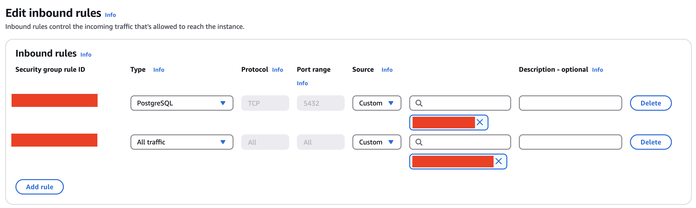

- Ensure RDS instance is **publicly accessible** (if you want to connect from outside the VPC) and **security group** needs to allow inbound connections on port 5432 (PostgreSQL)

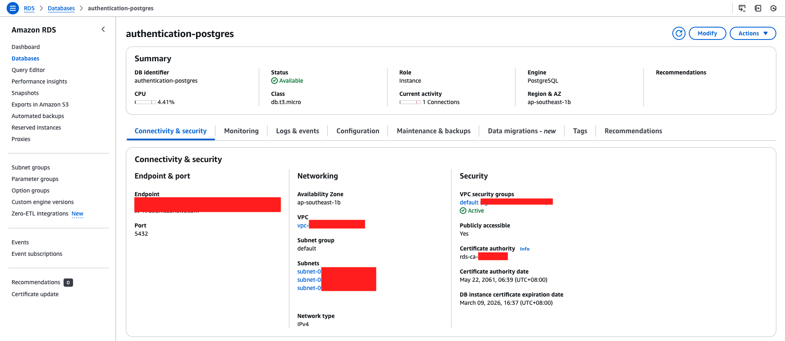

- After modifying the inbound rules, the RDS instance should be accessible from your local machine. Let's run the following command to connect to postgres database: `psql -h <RDS_ENDPOINT> -U <MASTER_USERNAME> -d postgres`

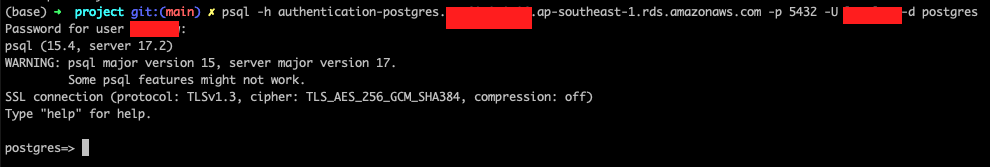

### 1.3 Create `imsdb` database

- We create a database for `imsdb` for authentication microservice to access it later.

```sql
-- Create ims-db database
CREATE DATABASE imsdb;
```

### 1.4 Create user `authentication-postgres` in `imsdb` database

- Connect to `imsdb` database with master user `<MASTER_USERNAME>`:\
  - `psql -h <RDS_ENDPOINT> -U <MASTER_USERNAME> -d imsdb`

```sql
-- Create username for authentication-postgres
CREATE USER authentication-postgres WITH PASSWORD '<PASSWORD>';

-- Grant all privileges on the imsdb database to the master user and authentication-postgres user
GRANT ALL PRIVILEGES ON DATABASE imsdb TO '<MASTER_USERNAME>';
GRANT ALL PRIVILEGES ON DATABASE imsdb TO authentication-postgres;

-- Grant all privileges on the public schema and specific privileges (SELECT, INSERT, UPDATE, DELETE) on all current tables within the public schema to authentication-postgres
GRANT ALL PRIVILEGES ON SCHEMA public TO authentication-postgres;
GRANT SELECT, INSERT, UPDATE, DELETE ON ALL TABLES IN SCHEMA public TO authentication-postgres;

-- Set default privileges to grant authentication-postgres all privileges on any new tables and sequences created in the public schema
ALTER DEFAULT PRIVILEGES IN SCHEMA public GRANT ALL ON TABLES TO authentication-postgres;
ALTER DEFAULT PRIVILEGES IN SCHEMA public GRANT ALL ON SEQUENCES TO authentication-postgres;

-- Lists details about the public schema, including its owner, access privileges, and description, if available
\dn+ public
```

### 1.5 Connect to `imsdb` database with newly created user `authentication-postgres`

```sh
# Attempt to connect using the newly created credentials
psql -h <RDS_ENDPOINT> -U authentication-postgres -d imsdb
```

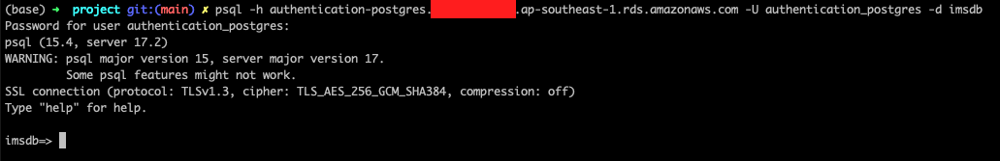

### 1.5 Create DB tables in Postgres Database

- Run the SQL script in `cd /server/project/init-db/init-authentication-db.sql` to create tables for our authentication microservice.

### 1.6 Add RDS Endpoint to our authentication microservice configuration file

Find the **RDS Endpoint** from the AWS Console and update the `.yaml` file in Authentication Microservice (`POSTGRES_PASSWORD`, `POSTGRES_HOST`) for the PostgreSQL Database Source Name (DSN)

```yaml
# In docker-compose.yml file
services:
  authentication-service:
    image: "xxxxxxxxxxxx.dkr.ecr.ap-southeast-1.amazonaws.com/ims-repository:authentication-service-latest"
    ports:
      - "50051:50051"
    environment:
      MODE: production
      POSTGRES_USER: authentication-postgres
      POSTGRES_PASSWORD: <POSTGRES_PASSWORD>
      POSTGRES_HOST: authentication-postgres.xxxxxxxxxxxx.ap-southeast-1.rds.amazonaws.com
      POSTGRES_PORT: 5432
      POSTGRES_DB: imsdb
    deploy:
      resources:
        limits:
          memory: 512M
```

This should generate the Database Source Name (DSN) for PostgreSQL connection in Authentication Microservice:

> `postgres://authentication-postgres:<POSTGRES_PASSWORD>@authentication-postgres.xxxxxxxxxxxx.ap-southeast-1.rds.amazonaws.com:5432/imsdb`

### 1.3 Connect to PostgreSQL Instance

```bash
# DSN Format: postgres://<username>:<password>@<rds_endpoint>:<port>/<database_name>
DATABASE_URL=postgres://admin:<SECURE_PASSWORD>@authentication-postgres.ap-southeast-1.rds.amazonaws.com:5432/imsdb
```

## Step 2: Prepare Your Docker Images

**Containerize** the microservices and push the Docker images to **Amazon Elastic Container Registry (ECR)** (private repository) to store the images securely. Elastic Beanstalk can then pull and deploy them.

### 2.1 Authenticate Docker with AWS ECR

Before pushing the Docker image, you need to authenticate Docker with AWS ECR by running the following command. This logs you into ECR so that Docker can push images to your AWS repository.

```sh
aws ecr get-login-password --region ap-southeast-1 | docker login --username AWS --password-stdin <AWS_ACCOUNT_ID>.dkr.ecr.ap-southeast-1.amazonaws.com
# Output: Login Succeeded

# Run the following command to ensure we are authenticated with AWS ECR
cat ~/.docker/config.json
```

### 2.2 Create an ECR Repository for IMS

```bash
# Creating ECR repository for IMS in ap-southeast-1 region because I am from Singapore 🤗 (low network latency)
aws ecr create-repository --repository-name ims-repository --region ap-southeast-1

# Check if ims-repository exists
aws ecr describe-repositories --region ap-southeast-1 | grep ims-repository
```

After creating the ECR for IMS, check if Registry is created in AWS Management Console.

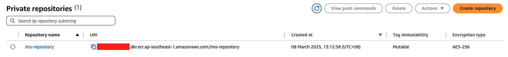

There are no images in our private registry currently, so let's push the Docker images in the following steps.

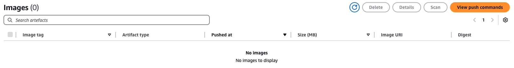

### 2.3 Build and Push Docker Images to `ims-repository`

- Navigate to `api-gateway` and `authentication-service` directory to perform `docker build` to build image for these services based on the `Dockerfile`.

```bash
cd api-gateway

# Create a Docker image for api-gateway from a Dockerfile and tag the image
docker build -f Dockerfile -t api-gateway:latest .

docker images
# REPOSITORY    TAG       IMAGE ID       CREATED         SIZE
# api-gateway   latest    82889edbc023   9 minutes ago   775MB

# Tag Docker Image for ease of pushing Docker Image to ECR later
docker tag api-gateway:latest <AWS_ACCOUNT_ID>.dkr.ecr.ap-southeast-1.amazonaws.com/ims-repository:api-gateway-latest

# Push tagged Docker Image to ECR ims-repository
docker push <AWS_ACCOUNT_ID>.dkr.ecr.ap-southeast-1.amazonaws.com/ims-repository:api-gateway-latest
```

```bash
# Do the same steps above for Authentication Microservice
cd authentication-service
docker build -f Dockerfile -t authentication-service:latest .
docker tag authentication-service:latest <AWS_ACCOUNT_ID>.dkr.ecr.ap-southeast-1.amazonaws.com/ims-repository:authentication-service-latest
docker push <AWS_ACCOUNT_ID>.dkr.ecr.ap-southeast-1.amazonaws.com/ims-repository:authentication-service-latest
```

After images are pushed, navigate to AWS Management Console and check private registry contains the IMS Docker Images.

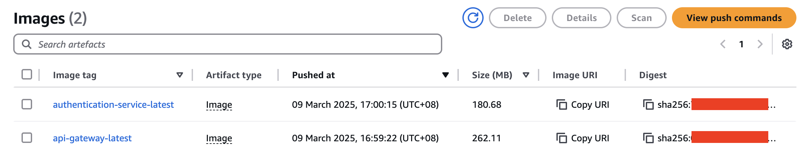

### 2.4 Check if Docker Images are in ECR via CLI

```bash
aws ecr list-images --repository-name ims-repository --region ap-southeast-1 | grep -E 'api-gateway|authentication-service'
# Output:
#             "imageTag": "api-gateway-latest"
#             "imageTag": "authentication-service-latest"
```

## Step 4: Define `docker-compose.yml` file

Elastic Beanstalk uses `docker-compose.yml` file to define multi-container applications.

```yml
version: "3.8" # Or another supported version
services:
  api-gateway:
    image: "<AWS_ACCOUNT_ID>.dkr.ecr.ap-southeast-1.amazonaws.com/ims-repository:api-gateway-latest"
    ports:
      - "80:80"
    environment:
      MODE: production
    deploy:
      resources:
        limits:
          memory: 512M
    depends_on:
      - authentication_service
    networks:
      - ims-network
  authentication-service:
    image: "<AWS_ACCOUNT_ID>.dkr.ecr.ap-southeast-1.amazonaws.com/ims-repository:authentication-service-latest"
    ports:
      - "50051:50051"
    environment:
      MODE: production
      POSTGRES_USER: FROM_ENV
      POSTGRES_PASSWORD: FROM_ENV
      POSTGRES_HOST: FROM_ENV
      POSTGRES_PORT: 5432
      POSTGRES_DB: imsdb
    deploy:
      resources:
        limits:
          memory: 512M
    networks:
      - ims-network
networks:
  ims-network:
    driver: bridge
```

## Step 5: Create an Elastic Beanstalk Environment

Now that everything is ready, let's deploy the IMS application!

### 5.1 Initialize Elastic Beanstalk

- `eb init` is the Elastic Beanstalk CLI command used to initialize a new Elastic Beanstalk application or configure an existing one.
- `-p docker`: The `-p` flag stands for "platform". By specifying `docker`, we are telling Elastic Beanstalk that the IMS application will be deployed with Docker.

```sh
eb init -p docker inventory-management-system --region ap-southeast-1
```

### 5.2 Add Permission to Elastic Beanstalk EC2 Role

- Do not run `eb create` before adding permission to elastic beanstalk EC2 role to read from AWS ECR because I got the following error previously:
  > `ERROR   Instance deployment: The ECR service failed to authenticate your private repository. The deployment failed.`
- **Solution**: https://stackoverflow.com/questions/39083768/aws-docker-deployment
  - Add `AmazonEC2ContainerRegistryReadOnly` permission to Elastic Beanstalk EC2 IAM Role
  - In AWS Management Console, go to IAM page --> Roles --> Search for "aws-elasticbeanstalk-ec2-role".
  - Under permission policies, add `AmazonEC2ContainerRegistryReadOnly` policy to "aws-elasticbeanstalk-ec2-role" IAM Role.
  - Added `AWSElasticBeanstalkWebTier` to provide the instances in your web server environment access to upload log files to Amazon S3.
  - Added `AWSElasticBeanstalkMulticontainerDocker` to provide the instances in your multicontainer Docker environment access to use the Amazon EC2 Container Service to manage container deployment tasks.
  - Added `AWSElasticBeanstalkWorkerTier` which is optional. If IMS application needs worker tiers (for background processing), this policy is needed.

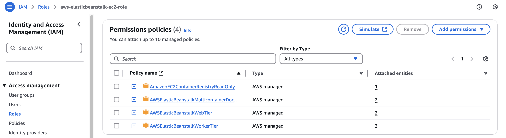

### 5.3 Create EBS Environment for IMS

- Setting up an environment in EBS as `production`.
- `--elb-type` option is used to specify the type of **Elastic Load Balancer (ELB)** to use when ELB environment is created.
  - ELB is responsible for distributing incoming traffic across EC2 instances to ensure IMS application is scalable and highly available.
  - For IMS, we will use Application Load Balancer (`application`) because we are allowing incoming HTTP/HTTPS traffic and ALB operates at the application layer as it is a Layer 7 Load Balancer.

```sh
eb create production --elb-type=application --region ap-southeast-1
# Output:
# 2025-03-08 18:12:25    INFO    createEnvironment is starting.
# 2025-03-08 18:12:27    INFO    Using elasticbeanstalk-ap-southeast-1-<AWS_ACCOUNT_ID> as Amazon S3 storage bucket for environment data.
# 2025-03-08 18:12:48    INFO    Created security group named:
# 2025-03-08 18:13:04    INFO    Created target group named:
# 2025-03-08 18:13:04    INFO    Created security group named:
# 2025-03-08 18:13:34    INFO    Created Auto Scaling group named:
# 2025-03-08 18:13:34    INFO    Waiting for EC2 instances to launch. This may take a few minutes.
# 2025-03-08 18:13:35    INFO    Created Auto Scaling group policy named:
# 2025-03-08 18:13:35    INFO    Created Auto Scaling group policy named:
# 2025-03-08 18:13:35    INFO    Created CloudWatch alarm named:
# 2025-03-08 18:13:35    INFO    Created CloudWatch alarm named:
# 2025-03-08 18:15:22    INFO    Created load balancer named:
# 2025-03-08 18:15:24    INFO    Created Load Balancer listener named:
# 2025-03-08 18:15:59    INFO    Instance deployment completed successfully.
# 2025-03-08 18:17:04    INFO    Successfully launched environment: production
```

### 5.4 Allow Ingress of EC2 instance in Beanstalk Application to RDS Instance

- Why do we need to do this?
  - By default, an RDS instance will not allow inbound traffic from an EC2 instance unless explicitly allowed in its security group rules.
  - The EC2 instances created by Elastic Beanstalk will typically have their own security group, and the RDS instance will have its own security group as well.
  - **Security groups are stateful firewalls**. If you don't modify the inbound rules of the RDS instance to allow traffic from the EC2 instances, they won't be able to communicate, and the application will not be able to connect to the database.

```sh
# List Security Group ID of RDS Instance
aws rds describe-db-instances --query "DBInstances[*].[DBInstanceIdentifier,VpcSecurityGroups[*].VpcSecurityGroupId]" --output text

# List Security Group ID of EC2 Instance (created by Elastic Beanstalk)
aws ec2 describe-instances --filters "Name=tag:elasticbeanstalk:environment-name,Values=production" --query "Reservations[*].Instances[*].SecurityGroups[*].GroupId" --output text

# Authorize Ingress Traffic between RDS and EC2 Security Groups
# --group-id specifies the security group to which the inbound rule will be applied
# --source-group specifies the security group that is allowed to send traffic to the security group defined in --group-id
aws ec2 authorize-security-group-ingress \
  --group-id <RDS_SECURITY_GROUP_ID> \
  --protocol tcp \
  --port 5432 \
  --source-group <EC2_SECURITY_GROUP_ID>
```

### 5.3 RDS Connection Error: `no pg_hba.conf entry for host`

- After Step 5.4, I redeployed my beanstalk application with `eb deploy` and ran into the following error (retrieved from `/eb-docker/containers/eb-current-app/eb-stdouterr.log` log file):

```
authentication-service_1  | 2025/03/10 12:44:27 Failed to connect to database with error: failed to connect to `host=authentication-postgres.xxxxxxxx.ap-southeast-1.rds.amazonaws.com user=authentication-postgres database=imsdb`: server error (FATAL: no pg_hba.conf entry for host "xxx.xx.xx.xxx", user "authentication-postgres", database "imsdb", no encryption (SQLSTATE 28000))
```

- Why does this happen?
  - PostgreSQL uses `pg_hba.conf` (Host-Based Authentication) to **control which IPs, users and databases are allowed to connect**. If there is no matching rule for the client's IP address, PostgreSQL **rejects the connection**.
- As a temporary measure, I have decided to follow this solution: https://stackoverflow.com/questions/76899023/rds-while-connection-error-no-pg-hba-conf-entry-for-host.
  - The solution in the StackOverflow link suggests changing `rds.force_ssl` from `1` to `0` which disables the requirement for SSL encryption, meaning clients can connect without encrypting their traffic.
  - Without SSL, credentials and queries (including sensitive data like passwords and PII) are sent **unencrypted** over the network.
  - For IMS project, the risk is acceptable because we are only testing the deployment of IMS to a Production environment. However, for actual production environment with users, we must enable SSL.
  - The solution involves creating a "New Parameter Group". In the new parameter group created, under "Filter Parameters", type `rds.force_ssl` and change the value from 1 to 0 for that parameter. Locate your RDS instance and modify the DB instance to use this parameter group.

### 5.4 Redeploy our Elastic Beanstalk

Run `eb deploy`

### 5.5 Running `/healthcheck` endpoint on API Gateway

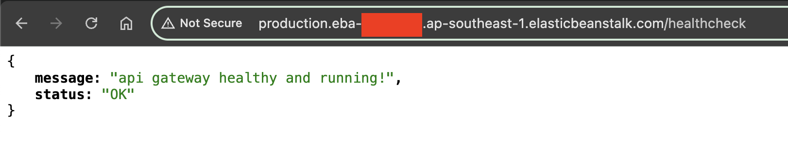

### 5.6 Running `/login` endpoint on API Gateway

- The `/login` endpoint in API Gateway will route the request via gRPC connection to the Authentication Microservice. Fortunately, it works 🎉

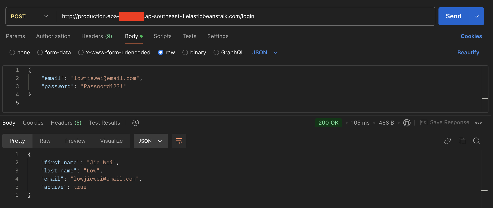

## 6. Appendix

### Retrieving Full Logs in a .zip File in Elastic Beanstalk

- **Warnings**: `/var/log/eb-engine.log`
- **Docker Container Errors**: `/var/log/eb-docker/containers/eb-current-app/eb-stdouterr.log`

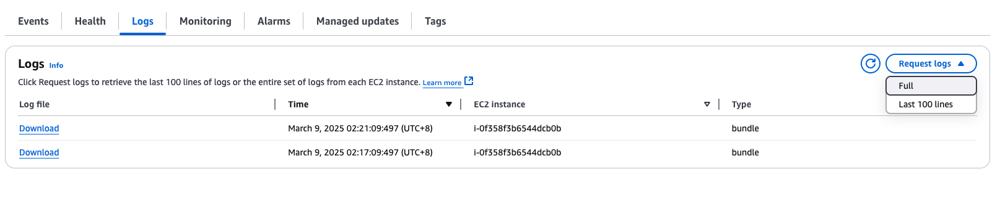

### Viewing AWS Elastic Beanstalk Environments

```sh
# List Elastic Beanstalk environments
eb list

# List Elastic Beanstalk environments across all applications
eb list --all

# Describe Elastic Beanstalk environments in detail
aws elasticbeanstalk describe-environments
```

## Cleanup Commands

```sh
## Terminate EBS
eb terminate <environment_name>

## View RDS Instances
aws rds describe-db-instances
## Terminate RDS
aws rds stop-db-instance --db-instance-identifier authentication-postgres
## Delete RDS
aws rds delete-db-instance --db-instance-identifier authentication-postgres --skip-final-snapshot

## Disconnect ingress between EC2 and RDS Instance, need this to perform `eb terminate` successfully
## because `eb terminate` deletes security groups
aws ec2 revoke-security-group-ingress \
  --group-id sg-01740c90b600f934b \
  --protocol tcp \
  --port 5432 \
  --source-group sg-0f94da57fbe40fd96
```
