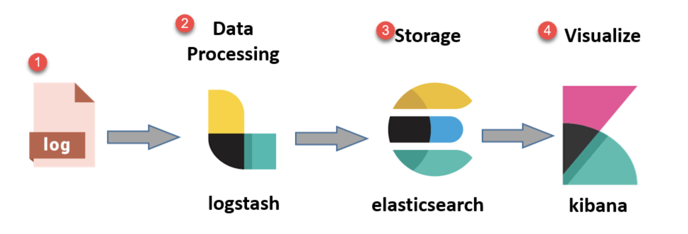
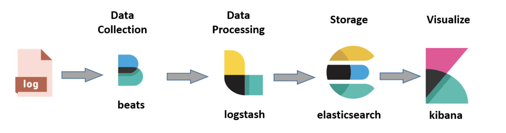
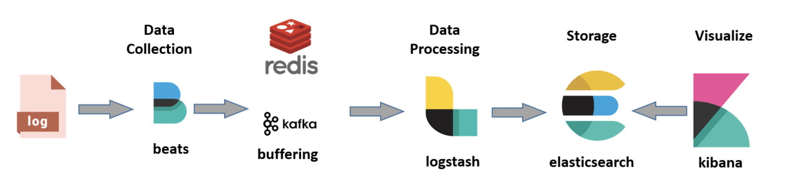

- [Reference](https://www.guru99.com/elk-stack-tutorial.html)
- [What is the ELK Stack?](#what-is-the-elk-stack)
- [What is ElasticSearch?](#what-is-elasticsearch)
  - [Feature of Elasticsearch](#features-of-elasticsearch)
  - [Advantages of Elasticsearch](#advantages-of-elasticsearch)
  - [Important Terms in Elasticsearch](#important-terms-in-elasticsearch)
- [What is LogStash?](#what-is-logstash)
- [URLs](#urls)

# What is the ELK Stack?

The ELK Stack is a collection of 3 open-source products - Elasticsearch, Logstash and Kibana. ELK stack provides **centralized logging** in order to identify problems with servers or applications. It allows you to search all the logs in a single place. It also helps to find issues in multiple servers by connecting logs during a specific time frame.

- **ElasticSearch**: used for storing logs
- **LogStash**: used for both shipping as well as processing and storing logs
- **Kibana**: visualization tool (a web interface) which is hosted through Nginx or Apache

ELK Stack is designed to allow users to take data from any source, in any format, and to search, analyze and visualize that data in real time.

# ELK Stack Architecture

- Simple Architecture of ELK Stack



- **Logs**: Server logs that need to be analyzed are identified
- **Logstash**: Collect logs and events data. It even parses and transforms data.
- **ElasticSearch**: The transformed data from Logstash is Stored, Searched and Indexed.
- **Kibana**: Uses ElasticSearch DB to Explore, Visualize and Share

- However, 1 more component is needed for data collection called **Beats**.



- While dealing with large amounts of data, you may need **Kafka, RabbitMQ** for buffering and resilience. For security, nginx can be used.



# What is Elasticsearch?

- Elasticsearch is a **NoSQL database**.
- Utilizes RESTful APIs for interaction.
- Offers easy and straightforward deployment.
- Designed for high reliability.
- Provides tools for simple and effective management.
- Supports advanced queries for detailed analysis.
- Stores all data centrally, enabling comprehensive search and analysis
- Excels at performing rapid searches of documents.
- Capable of storing, searching and analyzing large datasets.
- Commonly used as the engine for applications requiring robust search functionality.
- Widely adopted for search engine platforms in modern web and mobile applications.
- Beyond search, it offers complex analytics and advanced features for data analysis.

## Features of Elasticsearch

- Open source search server is written using Java
- Used to index any kind of heterogeneous data
- Has REST API web-interface with JSON output
- Full-Text Search
- Provides near real-time search capabilities
- Supports sharding and replication for scalable search
- Schema-free, distributed document store with JSON format
- Supports multiple languages
- Includes geo-location features

## Advantages of Elasticsearch

- Stores data without a predefined schema and can create schemas dynamically.
- Allows manipulation of data record by record.
- Facilitates filtering and querying for insights
- Utilizes Apache Lucene and provides a RESTful API
- Offers horizontal scalability, reliability and multi-tenancy
- Fast indexing and searching with real-time capabilities
- Supports both vertical and horizontal scaling

## Important Terms in Elasticsearch

|   Term   | Usage                                                                                                                                                                                                                                                         |
| :------: | ------------------------------------------------------------------------------------------------------------------------------------------------------------------------------------------------------------------------------------------------------------- |
| Cluster  | A cluster is a collection of nodes which together holds data and provides joined indexing and search capabilities                                                                                                                                             |
|   Node   | A node is an elasticsearch instance. It is created when an elasticsearch instance begins                                                                                                                                                                      |
|  Index   | An index is a collection of documents which has similar characteristics. E.g., customer data, product catalog. It is very useful when performing indexing, search, update and delete operations. It allows you to define as many indexes in 1 single cluster. |
| Document | It is the basic unit of information which can be indexed. It is expressed in JSON (key: value) pair. Every single document is associated with a type and a unique id.                                                                                         |
|  Shard   | Every index can be split into several shards to be able to distribute data. The shard is the atomic part of an index, which can be distributed over the cluster if you want to add more nodes.                                                                |

# What is LogStash?

- Acts as a data collection pipeline tool
- Feed data into Elasticsearch
- Collects data from various sources
- Unifies data from disparate sources
- Normalizes data into desired formats or destinations
- Allows for cleansing of data
- Makes data available for analytics and visualization
- Supports various use cases by preparing data for analysis and visualization

## Components of Logstash

- Logstash consists of 3 components:
  1.  **Input**: passing logs to process them into machine understandable format
  1.  **Filters**: It is a set of conditions to perform a particular action or event
  1.  **Output**: Decision maker for processed event or log

## Features of Logstash

- Events are passed through each phase using internal queries
- Allows different inputs for your logs
- Filtering/parsing for your log

## Advantage of Logstash

- Centralize data processing
- It analyzes a large variety of structure/unstructured data and events
- ELK Logstash offers plugins to connect with various types of input sources and platforms.

# What is Kibana?

- Used to visualize data in Elasticsearch.
- Offers various interactive diagrams, graphs and geospatial data
- Allows for searching, viewing and interacting with Elasticsearch data.
- Supports advanced data analysis capabilities
- Provides tables, charts and maps for data visualization
- Helps developers gain quick insights into complex queries and data patterns

## Kibana search types

| Search Type          | Usage                                                   |
| -------------------- | ------------------------------------------------------- |
| Free Text Searches   | For searching a specific string                         |
| Field-level Searches | For searching a string within a specific field          |
| Logical Statements   | To combine searches into a logical statement            |
| Proximity Searches   | For searching terms within specific character proximity |

# Useful URLs

```
# view elasticsearch indices
http://localhost:9200/_cat/indices?v

# Kibana UI
http://localhost:5601

# elasticsearch cluster health
http://localhost:9200/_cluster/health?pretty
```
